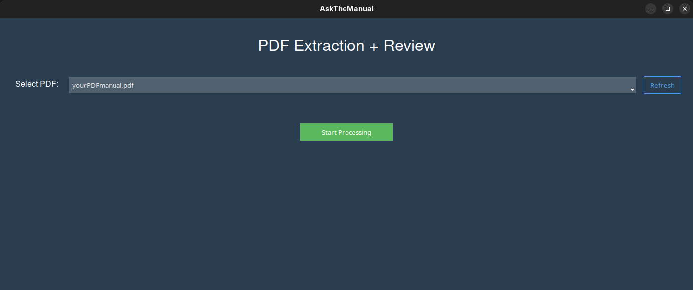
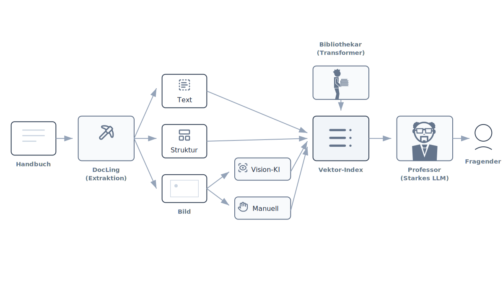

# AskTheManual – Ein Multimodaler RAG-PoC

**AskTheManual** ist ein "Multimodal Retrieval-Augmented Generation" (RAG) Proof of Concept, entwickelt, um Handbücher für Ihre Kunden zu lesen, zu sehen und zu erklären. Es verwandelt statische PDF-Handbücher in einen interaktiven Chatbot, der sowohl Text als auch Bilder versteht.

**Neu:** Jetzt mit einer **grafischen Benutzeroberfläche (GUI)**, um den Prozess der Datenverarbeitung einfach und intuitiv zu gestalten!



## Was es ist
Dieses Projekt folgt einer mehrstufigen Pipeline, um eine durchsuchbare Wissensdatenbank zu erstellen:
1.  **Extraktion:** Konvertiert detaillierte PDF-Handbücher in Markdown.
2.  **Human-in-the-Loop Überprüfung:** Eine GUI ermöglicht es Ihnen, "unnötige" Bilder (Icons, decorative Elemente) herauszufiltern und nur relevante Diagramme zu behalten.
3.  **Vision Enrichment:** Verwendet KI (oder menschliche Eingaben), um Screenshots zu beschreiben und visuelle Informationen in durchsuchbaren Text umzuwandeln.
4.  **Vektor-Indexierung:** Speichert den angereicherten Inhalt in einer lokalen Vektor-Datenbank.
5.  **Lokaler Chat:** Ein Streamlit-Dashboard, um Ihr Handbuch abzufragen.

## Vorteile
*   **Lokale Kontrolle & Datenschutz:** Nutzt lokal **Ollama** und **FAISS** als das zentrale "Gehirn". Ihre proprietären Handbuchtexte bleiben lokal.
*   **Keine "Black Box":** Sie kontrollieren die Extraktion. Sie entscheiden, welche Bilder strikt in die Wissensdatenbank gehören.
*   **Multimodal:** Der Bot versteht, was in Screenshots zu sehen ist (z.B. "Die Standard-IP ist 127.0.0.1"), da die Pipeline dies explizit erfasst.



---

## 🛠️ Installation

### 1. Voraussetzungen
Stellen Sie sicher, dass Sie Python 3.10+ installiert haben.

```bash
pip install streamlit docling langchain-huggingface langchain-community faiss-cpu sentence-transformers requests ttkbootstrap openai
```
*(Hinweis: `ttkbootstrap` wird für die neue GUI benötigt.)*  
```bash
docling-tools models download
```

### 2. Ollama einrichten (Lokale LLM)
1.  Installieren Sie **Ollama** von [ollama.com](https://ollama.com).
2.  Laden Sie ein Modell herunter (z.B. Qwen 2.5):
    ```bash
    ollama pull qwen2.5:7b
    ```
3.  Stellen Sie sicher, dass der Ollama-Server läuft.

### 3. Embedding Modell laden (Verhindert GUI-Freeze)
Das Projekt nutzt `sentence-transformers/paraphrase-multilingual-MiniLM-L12-v2`. Um zu verhindern, dass die GUI beim ersten Start während des Downloads einfriert, führen Sie diesen Befehl aus:

```bash
python -c "from langchain_huggingface import HuggingFaceEmbeddings; HuggingFaceEmbeddings(model_name='sentence-transformers/paraphrase-multilingual-MiniLM-L12-v2')"
```

### 4. OpenAI API Schlüssel (Optional aber empfohlen)
Für die automatische Bildbeschreibung (**Vision AI**) benötigen Sie einen OpenAI API Schlüssel. 
-   Exportieren Sie ihn: `export OPENAI_API_KEY="sk-..."` 
-   Oder fügen Sie ihn in `image_to_information.py` ein (nicht empfohlen für Produktion).

---

## 📂 Nutzungsablauf

### Schritt 1: Einlesen & Verarbeiten (Die GUI)
Wir haben die komplexe Skript-Kette durch eine einzelne App ersetzt.

Starten Sie die GUI:
```bash
python AskTheManual_GUI.py
```

**Die App führt Sie durch 3 Stufen:**

1.  **Extraktion & Überprüfung**:
    *   Wählen Sie Ihre PDF aus. (Sie muss sich im Hauptverzeichnis des Projektordners befinden)
    *   Die App extrahiert alle Bilder.
    *   **Interaktive Überprüfung**: Eine Galerie erscheint. Nutzen Sie die **Pfeiltasten** zum Navigieren. Drücken Sie **'DELETE'**, um unnötige Bilder zu löschen, **'KEEP'** um gültige zu behalten.
    
2.  **Anreicherung (Enrichment)**:
    *   **Vision AI (Automatisch, aber eventuell nicht jede Beschreibung korrekt)**: Sendet behaltene Bilder an OpenAI, um detaillierte technische Beschreibungen zu generieren.
    *   **Menschliche Beschreibung (empfohlen - wenn Sie sichergehen wollen, dass alles korrekt ist)**: Wenn Sie keinen API-Schlüssel haben, können Sie Beschreibungen für jedes Bild manuell in der GUI eingeben.

3.  **Indexierung**:
    *   Klicken Sie auf "Update Vector Index", um die Datenbank zu finalisieren.

### Schritt 2: Chatten Sie mit Ihrem Handbuch
Sobald die Indexierung abgeschlossen ist, starten Sie das Chat-Interface:

```bash
streamlit run chatbot_dashboard.py
```

---

## ⚠️ Haftungsausschluss
Dieser PoC ist für interne Tests und Demonstrationszwecke gedacht. Er dient als Blaupause dafür, wie technische Dokumentation "intelligent" gemacht werden kann, indem Text-Parser, Vision AI und Vektor-Suche kombiniert werden.
